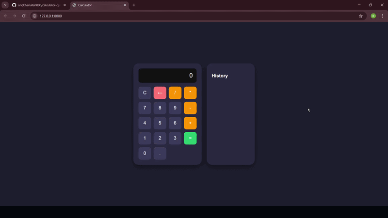

# 🌐 Web Development Learning Journey (Calculator + Django)

A collection of projects built to learn both **frontend and backend web development**.
This repository combines a JavaScript-based calculator project and a Django learning project to demonstrate understanding of full-stack concepts.

---

## 🛠️ Technologies

* HTML
* CSS
* JavaScript
* Python
* Django

---

## ✨ Features

### 🧮 Calculator Web App (Frontend)

* Basic arithmetic operations:

  * Addition (+)
  * Subtraction (-)
  * Multiplication (*)
  * Division (/)
* Interactive button-based input
* Real-time display updates
* Clear button (C) and Delete button (←)
* Calculation using "="
* History system:

  * Stores previous calculations
  * Click history to reuse results

---

### 🐍 Django Learning (Backend)

* Django project & app structure
* URL routing (`urls.py`)
* Views handling requests
* Template rendering using Django Template Language
* Static files integration (CSS & JavaScript)
* Template inheritance
* Basic request-response cycle understanding

---

## ⚙️ The Process

### Frontend (Calculator)

* Designed UI using HTML & CSS (Flexbox & Grid)
* Handled user interaction using JavaScript:

  * `addEventListener` for button clicks
  * Managed state using variables (`currentInput`)
  * Used `if...else` for logic control
* Implemented features:

  * Calculation using `eval()`
  * Delete using `slice()`
  * History using arrays + DOM manipulation
* Updated UI dynamically using:

  * `textContent`
  * `createElement`
  * `appendChild`

---

### Backend (Django)

* Set up Django project and app
* Configured URL routing
* Created views to handle requests
* Connected templates to views using `render()`
* Used Django Template Language:

  * `` for logic
  * `{{ }}` for data
* Connected static files using ``

---

## 🔄 How It Works

### Calculator Flow

1. User clicks button
2. JavaScript captures event
3. Input is updated (`currentInput`)
4. Display updates in real-time
5. When "=" is pressed:

   * Expression is evaluated
   * Result displayed
   * Saved to history

---

### Django Flow

1. User sends request via browser
2. Django handles request via `urls.py`
3. Request is sent to a view
4. View processes logic
5. Template renders HTML
6. Response is sent back to browser

---

## 📚 What I Learned

* Strong understanding of **DOM manipulation**
* Improved skills in **event handling**
* Learned how to manage **state in JavaScript**
* Practiced **conditional logic and error handling**
* Learned how to structure a **Django project**
* Understood **request-response cycle**
* Gained basic knowledge of **full-stack development**

---

## 🚧 Future Improvements

* Add keyboard support to calculator
* Replace `eval()` with safer logic
* Limit history and improve UI
* Add Django database (Models & ORM)
* Build CRUD features
* Add authentication system
* Deploy full project

---

## ▶️ Running the Project

### Calculator (Frontend)

1. Open project folder
2. Run `index.html` in browser

---

### Django (Backend)

1. Install Django:

   ```bash
   pip install django
   ```
2. Run server:

   ```bash
   python manage.py runserver
   ```
3. Open browser:

   ```
   http://127.0.0.1:8000/
   ```

---

## 🎥 Demo



---

## 👤 Author

**Bariq Khairullah**
